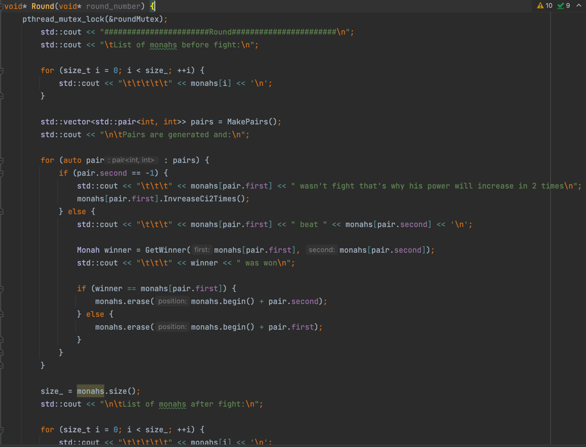
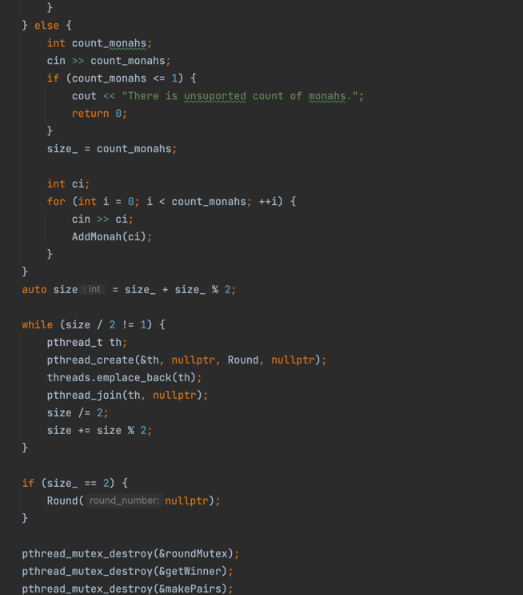
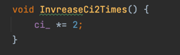
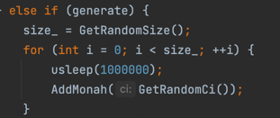
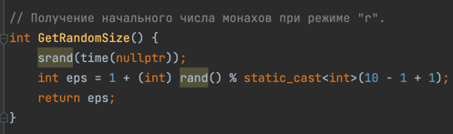

# ИДЗ4, вариант29, отчёт

## Эксперементные вещи
#### Запуск потоков через цикл

Идея: хотел все потоки, выполняющую программу, засунуть в один массив, а потом последовательно вызвать их с помощью цикла (этой идеи я придерживался основное время разработки программы)

НО: что-то пошло не так, и программа начала кидать ошибку, вылетать при количестве монахов > 4.

Пробовал вставить мьютексы - не помогло (их можео увидеть в программе)

В итоге позже пришла гениальная идея, которая сделала выполнение программы на ура при любом количестве монахов. А вот какую именно, Вы можете посмотреть ниже.

#### Реализация с помощью ООП

Чтобы не путаться и долго не искать ошибки, я решил реализовать по началу программу с помощью ООП (задатки Вы можете увидеть в классе "Monah"), но в процессе работы с pthread выяснилось, что функции, которые передаются в потоки должны быть статическими, что в целом логично. И, соответственно, пришлось делать большинство членов класса статическими.

Фуннции, которые пришлось делать статическими:

- Round
- GetRandomNum
- MakePairs
- GetWinner

Данные, которые пришлось делать статическими:

- std::vector<Monah> monahs
- int size_

Поэтому лишний класс я решил удалить, и все эти члены вынести на уровень main.

## Заметки
- Комменты к коду добавлены
- Выполнено на 9
- Программа понимает, что надо импортирвать данные с файла по заданному пути и загрузить её вывод в выходной файл или сгенерировать, если в аргументах консоли были введены соответсвующие пути к файлам через пробел или 'r', соответственно.
- В входных файлах все данные надо указывать через \n

## Условия задач

Задача о Пути Кулака. 

На седых склонах Гималаев стоит древний буддистский монастырь: Гуань-Инь-Янь. Каждый год в день сошествия на землю боддисатвы Монахи монастыря собираются на совместное празднество и
показывают свое совершенствование на Пути Кулака. Всех соревнующихся
монахов разбивают на пары, победители пар бьются затем между собой и так
далее, до финального поединка. Монах который победил в финальном бою,
забирает себе на хранение статую боддисатвы. Реализовать многопоточное
приложение, определяющего победителя. В качестве входных данных используется массив, в котором хранится количество энергии Ци каждого монаха. При победе монах забирает энергию Ци своего противника. Разбивка на
пары перед каждым сражением осуществляется случайным образом. Монах,
оставшийся без пары, удваивает свою энергию, отдохнув от поединка. При
решении использовать принцип дихотомии.

## Описание модели параллельных вычислений, используемой при разработке многопоточной программы

При разработки многопоточной программы "Задача о Пути Кулака" использовался принцип дихотомии, подразумевающий разделение программы на потоки в виде дерева. 

В данном случае на вход подаётся множества листьев - Монахи, а на выход подаётся корень задачи - Монах, забравший себе статую боддиставы.

## Программа на С++

#### Подключение необходимых файлов и библиотек

- Библиотека fstream нужна для работы с файлами
- Заголовок unistd.h нужен для задержки времени, которая в свою очередь необходима для получения случайного, неповторяющегося числа
- файл Monah.cpp нужен для дальнейшей работы программы

#### Инициализация статических переменных

- В первой строчке объявляем мьютексы для того, чтобы последовательно закрепллять их выполнения за текущим потоком среди потоков
- monahs нужен для хранения и управления монахами
- size_ нужен для хранения текущего размера monahs

#### Разработка необходимых функций
- AddMonah для добавления монаха в monahs

- GetRandomNum - для получения случайного числа из диапозона (при генерации пары для вершины в методе MakePairs)

- GetRandomSize - для генерации случайного числа в режиме "r"

- GetRandomCi - для генерации случайного размера ци в режиме "r"

- MakePairs - для генерации пар случайных вершин, использующиеся в проведении битв между монахами

- GetWinner - для получения победителя в парной схватке

- Round - для проведения очередного раунда

- main - для запуска программы и сборки всех разработанных функций воедино

#### Разработка класса Monah
**private data**
- Данные для хранения (ци монаха)

- Функция для выяснения является ли ци, переданное через конструктор, корректным.

Ограничился INT_MAX так, как нужно ещё как-то удваивать ци монаха. В плане, если максимальным значением было бы uint64_t_MAX, то ци могло стать меньше, чем было из-за макс числа uint64_t.

**public data**
- Конструктор с ци монаха

- Получение ци монаха

- Увеличение ци монаха в 2 раза, если не нашлась для него пара в раунде

- Получение строкового представления класса Monah

- Перегрузка операции << для вывода класса Monah

- Перегрузка операции == для сравнения двух монахов

#### Поддержка случайного ввода данных

#### Файловый ввод/вывод
- Инициализация файлов

- Чтение данных + закрытие входного файла

- Запись данных + закрытие выходного файла

#### Комментирование кода

- GetRandomNum

- GetRandomSize

- GetRandomCi

- MakePairs

- Round

- main

## Ограничение по входным данным
- кол-во монахов должно быть > 1 и < 2147483648, но свыше 10 монахов программа будет выполняться сликом долго (дольше 20 секунд)
- ci монаха должно быть > 0 и < 2147483648

## Разработка тестов для программы
####  Проверка выполнения работоспособности
- Входные данные: tests/Console/1/1.in
- Выходные данные: tests/Console/1/1.out

#### Большие потоки
- Входные данные: tests/Console/2/2.in
- Выходные данные: tests/Console/2/2.out

#### Рандомные числа
- Входные данные: "r" в командной строке
- Выходные данные: Monah with ci = ... won

#### Файловый ввод/вывод
- Входные данные: "inputPath outputPath" в командной строке
- Содержимое файлов можете увидеть tests/file/i.txt
- Вывод в файл: tests/file/o.txt

## Тестирование программы
#### Проверка выполнения работоспособности

=> ok

#### Большие потоки

 

=> ok

#### Рандомные числа

=> ok

#### Файловый ввод/вывод

